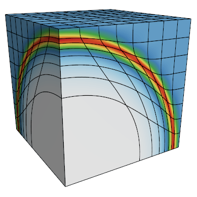

               __                __
              / /   ____  ____  / /_  ____  _____
             / /   / __ `/ __ `/ __ \/ __ \/ ___/
            / /___/ /_/ / /_/ / / / / /_/ (__  )
           /_____/\__,_/\__, /_/ /_/\____/____/
                       /____/

        High-order Lagrangian Hydrodynamics Miniapp


## Purpose

**Laghos** (LAGrangian High-Order Solver) is a miniapp that solves the
time-dependent Euler equation of compressible gas dynamics in a moving
Lagrangian frame using unstructured high-order finite element spatial
discretization and explicit high-order time-stepping.

Laghos is based on the discretization method described in the following article:

> V. Dobrev, Tz. Kolev and R. Rieben,<br>
> [High-order curvilinear finite element methods for Lagrangian hydrodynamics](https://doi.org/10.1137/120864672), <br>
> *SIAM Journal on Scientific Computing*, (34) 2012, pp.B606–B641.

Laghos captures the basic structure of many other compressible shock
hydrocodes, including the [BLAST code](http://llnl.gov/casc/blast) at
[Lawrence Livermore National Laboratory](http://llnl.gov). The miniapp
is build on top of a general discretization library, [MFEM](http://mfem.org),
thus separating the pointwise physics from finite element and meshing concerns.

The Laghos miniapp is part of the [CEED software suite](http://ceed.exascaleproject.org/software),
a collection of software benchmarks, miniapps, libraries and APIs for
efficient exascale discretizations based on high-order finite element
and spectral element methods. See http://github.com/ceed for more
information and source code availability.

The CEED research is supported by the [Exascale Computing Project](https://exascaleproject.org/exascale-computing-project)
(17-SC-20-SC), a collaborative effort of two U.S. Department of Energy
organizations (Office of Science and the National Nuclear Security
Administration) responsible for the planning and preparation of a
[capable exascale ecosystem](https://exascaleproject.org/what-is-exascale),
including software, applications, hardware, advanced system engineering and early
testbed platforms, in support of the nation’s exascale computing imperative.

## Characteristics

In each time step, the problem is ultimately formulated as solving a big system
of ordinary differential equations (ODE) for the unknown (high-order) velocity,
internal energy and mesh nodes (position). The left-hand side of this ODE is
controlled by *mass matrices* (one for velocity and one for energy), while the
right-hand side is constructed from a *force matrix*.

Laghos supports two options for deriving and solving the ODE system, namely the
*full assembly* and the *partial assembly* methods. Partial assembly is the main
algorithm of interest for high orders. For low orders (e.g. 2nd order in 3D),
both algorithms are of interest.

The full assembly options relies on constructing and utilizing global mass and
force matrices stored in compressed sparse row (CSR) format.

The [partial assembly](http://ceed.exascaleproject.org/ceed-code) option defines
only the local action of those matrices, which is then used to perform all
necessary operations. As the local action is defined by utilizing the tensor
structure of the finite element spaces, the amount of data storage, memory
transfers, and FLOPs are lower (especially for higher orders).

Other computational motives in Laghos include the following:

- Support for unstructured meshes, in 2D and 3D, with quadrilateral and
  hexahedral elements (triangular and tetrahedral elements can also be used, but
  with the less efficient full assembly option). Serial and parallel mesh
  refinement options can be set via a command-line flag.
- Explicit time-stepping loop with a variety of time integrator options. Laghos
  supports Runge-Kutta ODE solvers of orders 1, 2, 3, 4 and 6.
- Continuous and discontinuous high-order finite element discretization spaces
  of runtime-specified order.
- Moving (high-order) meshes.
- Separation between the assembly and the quadrature point-based computations.
- Point-wise definition of mesh size, time-step estimate and artificial
  viscosity coefficient.
- When full assembly is used, constant-in-time mass matrices are inverted
  iteratively on each time step (assemble once, evaluate many times) coupled
  with a time-dependent force matrix that is assembled on each time step and
  evaluated just twice.
- When partial assembly is used, the action of the 2D and 3D mass matrices and
  force matrix is performed by using only the 1D finite element basis
  functions and the corresponding data at quadrature points.
- Domain-decomposed MPI parallelism.
- Optional in-situ visualization with [GLVis](http:/glvis.org) and data output
  for visualization / data analysis with [VisIt](http://visit.llnl.gov).

## Code Structure

- The file `laghos.cpp` contains the main driver with the time integration loop
  starting around line 310.
- In each time step, the ODE system of interest is constructed and solved by
  the class `LagrangianHydroOperator`, defined around line 258 of `laghos.cpp`
  and implemented in files `laghos_solver.hpp` and `laghos_solver.cpp`.
- All quadrature-based computations are performed in the function
  `LagrangianHydroOperator::UpdateQuadratureData` in `laghos_solver.cpp`.
- Depending on the chosen option (`-pa` for partial assembly or `-fa` for full
  assembly), the function `LagrangianHydroOperator::Mult` uses the corresponding
  method to construct and solve the final ODE system.
- The full assembly computations for all mass matrices are performed by the MFEM
  library, e.g., classes `MassIntegrator` and `VectorMassIntegrator`.  Full
  assembly of the ODE's right hand side is performed by utilizing the class
  `ForceIntegrator` defined in `laghos_assembly.hpp`.
- The partial assembly computations are performed by the classes
  `ForcePAOperator` and `MassPAOperator` defined in `laghos_assembly.hpp`.
- When partial assembly is used, the main computational kernels are the
  `Mult*` functions of the classes `MassPAOperator` and `ForcePAOperator`
  implemented in file `laghos_assembly.cpp`. These functions have specific
  versions for quadrilateral and hexahedral elements.
- The orders of the velocity and position (continuous kinematic space)
  and the internal energy (discontinuous thermodynamic space) are given
  by the `-ov` and `-ot` input parameters, respectively.

## Building

Laghos has the following external dependencies:

- *hypre*, used for parallel linear algebra, we recommend version 2.10.0b<br>
   https://computation.llnl.gov/casc/hypre/software.html,

-  METIS, used for parallel domain decomposition (optional), we recommend [version 4.0.3](http://glaros.dtc.umn.edu/gkhome/fetch/sw/metis/OLD/metis-4.0.3.tar.gz) <br>
   http://glaros.dtc.umn.edu/gkhome/metis/metis/download

- MFEM, used for (high-order) finite element discretization, we recommend version 3.4 <br>
  http://mfem.org/download

To build the miniapp, first download *hypre*, METIS and MFEM from the links above
and put everything on the same level as Laghos:
```sh
~> ls
Laghos/ hypre-2.10.0b.tar.gz   metis-4.0.tar.gz   mfem-3.4.tgz
```

Build *hypre*:
```sh
~> tar -zxvf hypre-2.10.0b.tar.gz
~> cd hypre-2.10.0b/src/
~/hypre-2.10.0b/src> ./configure --disable-fortran
~/hypre-2.10.0b/src> make -j
~/hypre-2.10.0b/src> cd ../..
```

Build METIS:
```sh
~> tar -zxvf metis-4.0.3.tar.gz
~> cd metis-4.0.3
~/metis-4.0.3> make
~/metis-4.0.3> cd ..
~> ln -s metis-4.0.3 metis-4.0
```

Build the parallel version of MFEM:
```sh
~> tar -zxvf mfem-3.4.tgz
~> cd mfem-3.4/
~/mfem-3.4> make parallel -j
~> cd ..
~> ln -s mfem-3.4 mfem
```

Build Laghos
```sh
~> cd Laghos/
~> make
```

For more details, see the [MFEM building page](http://mfem.org/building/).

## Running

#### Sedov blast

The main problem of interest for Laghos is the Sedov blast wave (`-p 1`) with
partial assembly option (`-pa`).

Some sample runs in 2D and 3D respectively are:
```sh
mpirun -np 8 laghos -p 1 -m data/square01_quad.mesh -rs 3 -tf 0.8 -no-vis -pa
mpirun -np 8 laghos -p 1 -m data/cube01_hex.mesh -rs 2 -tf 0.6 -no-vis -pa
```

The latter produces the following density plot (when run with `-vis` instead of `-no-vis`)



#### Taylor-Green vortex

Laghos includes also a smooth test problem, that exposes all the principal
computational kernels of the problem except for the artificial viscosity
evaluation.

Some sample runs in 2D and 3D respectively are:
```sh
mpirun -np 8 laghos -p 0 -m data/square01_quad.mesh -rs 3 -tf 0.5 -no-vis -pa
mpirun -np 8 laghos -p 0 -m data/cube01_hex.mesh -rs 1 -cfl 0.1 -tf 0.25 -no-vis -pa
```

The latter produces the following velocity magnitude plot (when run with `-vis` instead of `-no-vis`)


## Verification of Results

To make sure the results are correct, we tabulate reference final iterations
(`step`), time steps (`dt`) and energies (`|e|`) for the four runs listed above:

1. `mpirun -np 8 laghos -p 1 -m data/square01_quad.mesh -rs 3 -tf 0.8 -no-vis -pa`
2. `mpirun -np 8 laghos -p 1 -m data/cube01_hex.mesh -rs 2 -tf 0.6 -no-vis -pa`
3. `mpirun -np 8 laghos -p 0 -m data/square01_quad.mesh -rs 3 -tf 0.5 -no-vis -pa`
4. `mpirun -np 8 laghos -p 0 -m data/cube01_hex.mesh -rs 1 -cfl 0.1 -tf 0.25 -no-vis -pa`

| run | `step` | `dt` | `e` |
| --- | ------ | ---- | --- |
|  1. | 858 | 0.001490 | 46.5170240752 |
|  2. | 444 | 0.001282 | 134.0791900734 |
|  3. | 669 | 0.000165 | 49.5731419667 |
|  4. | 457 | 0.000152 | 3389.9229830873 |

An implementation is considered valid if the final energy values are all within
round-off distance from the above reference values.

## Contact
You can reach the Laghos team by emailing laghos@llnl.gov or by leaving a
comment in the [issue tracker](https://github.com/CEED/Laghos/issues).

## Copyright

The following copyright applies to each file in the CEED software suite,
unless otherwise stated in the file:

> Copyright (c) 2017, Lawrence Livermore National Security, LLC. Produced at the
> Lawrence Livermore National Laboratory. LLNL-CODE-XXXXXX. All Rights reserved.
