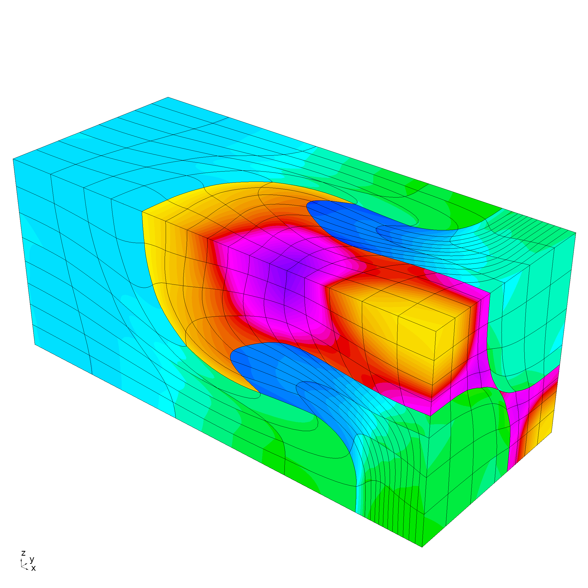

               __                __
              / /   ____  ____  / /_  ____  _____
             / /   / __ `/ __ `/ __ \/ __ \/ ___/
            / /___/ /_/ / /_/ / / / / /_/ (__  )
           /_____/\__,_/\__, /_/ /_/\____/____/
                       /____/

        High-order Lagrangian Hydrodynamics Miniapp

[](https://travis-ci.org/CEED/Laghos)

## Purpose

**Laghos** (LAGrangian High-Order Solver) is a miniapp that solves the
time-dependent Euler equations of compressible gas dynamics in a moving
Lagrangian frame using unstructured high-order finite element spatial
discretization and explicit high-order time-stepping.

Laghos is based on the discretization method described in the following article:

> V. Dobrev, Tz. Kolev and R. Rieben <br>
> [High-order curvilinear finite element methods for Lagrangian hydrodynamics](https://doi.org/10.1137/120864672) <br>
> *SIAM Journal on Scientific Computing*, (34) 2012, pp. B606–B641.

Laghos captures the basic structure of many compressible shock hydrocodes,
including the [BLAST code](http://llnl.gov/casc/blast) at [Lawrence Livermore
National Laboratory](http://llnl.gov). The miniapp is built on top of a general
discretization library, [MFEM](http://mfem.org), thus separating the pointwise
physics from finite element and meshing concerns.

The Laghos miniapp is part of the [CEED software suite](http://ceed.exascaleproject.org/software),
a collection of software benchmarks, miniapps, libraries and APIs for
efficient exascale discretizations based on high-order finite element
and spectral element methods. See http://github.com/ceed for more
information and source code availability.

The CEED research is supported by the [Exascale Computing Project](https://exascaleproject.org/exascale-computing-project)
(17-SC-20-SC), a collaborative effort of two U.S. Department of Energy
organizations (Office of Science and the National Nuclear Security
Administration) responsible for the planning and preparation of a
[capable exascale ecosystem](https://exascaleproject.org/what-is-exascale),
including software, applications, hardware, advanced system engineering and early
testbed platforms, in support of the nation’s exascale computing imperative.

## Characteristics

The problem that Laghos is solving is formulated as a big (block) system of
ordinary differential equations (ODEs) for the unknown (high-order) velocity,
internal energy and mesh nodes (position). The left-hand side of this system of
ODEs is controlled by *mass matrices* (one for velocity and one for energy),
while the right-hand side is constructed from a *force matrix*.

Laghos supports two options for deriving and solving the ODE system, namely the
*full assembly* and the *partial assembly* methods. Partial assembly is the main
algorithm of interest for high orders. For low orders (e.g. 2nd order in 3D),
both algorithms are of interest.

The full assembly option relies on constructing and utilizing global mass and
force matrices stored in compressed sparse row (CSR) format.  In contrast, the
[partial assembly](http://ceed.exascaleproject.org/ceed-code) option defines
only the local action of those matrices, which is then used to perform all
necessary operations. As the local action is defined by utilizing the tensor
structure of the finite element spaces, the amount of data storage, memory
transfers, and FLOPs are lower (especially for higher orders).

The Laghos implementation includes support for hardware devices, such
as GPUs, and programming models, such as CUDA, OCCA, RAJA and OpenMP,
based on [MFEM](http://mfem.org), version 4.1 or later. These device
backends are selectable at runtime, see the `-d/--device` command-line
option.

Other computational motives in Laghos include the following:

- Support for unstructured meshes, in 2D and 3D, with quadrilateral and
  hexahedral elements (triangular and tetrahedral elements can also be used, but
  with the less efficient full assembly option). Serial and parallel mesh
  refinement options can be set via a command-line flag.
- Explicit time-stepping loop with a variety of time integrator options. Laghos
  supports Runge-Kutta ODE solvers of orders 1, 2, 3, 4 and 6, as well as a
  specialized Runge-Kutta method of order 2 that ensures exact energy
  conservation on fully discrete level (RK2Avg).
- Continuous and discontinuous high-order finite element discretization spaces
  of runtime-specified order.
- Moving (high-order) meshes.
- Separation between the assembly and the quadrature point-based computations.
- Point-wise definition of mesh size, time-step estimate and artificial
  viscosity coefficient.
- Constant-in-time velocity mass operator that is inverted iteratively on
  each time step. This is an example of an operator that is prepared once (fully
  or partially assembled), but is applied many times. The application cost is
  dominant for this operator.
- Time-dependent force matrix that is prepared every time step (fully or
  partially assembled) and is applied just twice per "assembly". Both the
  preparation and the application costs are important for this operator.
- Domain-decomposed MPI parallelism.
- Optional in-situ visualization with [GLVis](http:/glvis.org) and data output
  for visualization and data analysis with [VisIt](http://visit.llnl.gov).

## Code Structure

- The file `laghos.cpp` contains the main driver with the time integration loop
  starting around line 609.
- In each time step, the ODE system of interest is constructed and solved by
  the class `LagrangianHydroOperator`, defined around line 544 of `laghos.cpp`
  and implemented in files `laghos_solver.hpp` and `laghos_solver.cpp`.
- All quadrature-based computations are performed in the function
  `LagrangianHydroOperator::UpdateQuadratureData` in `laghos_solver.cpp`.
- Depending on the chosen option (`-pa` for partial assembly or `-fa` for full
  assembly), the function `LagrangianHydroOperator::Mult` uses the corresponding
  method to construct and solve the final ODE system.
- The full assembly computations for all mass matrices are performed by the MFEM
  library, e.g., classes `MassIntegrator` and `VectorMassIntegrator`.  Full
  assembly of the ODE's right hand side is performed by utilizing the class
  `ForceIntegrator` defined in `laghos_assembly.hpp`.
- The partial assembly computations are performed by the classes
  `ForcePAOperator` and `MassPAOperator` defined in `laghos_assembly.hpp`.
- When partial assembly is used, the main computational kernels are the
  `Mult*` functions of the classes `MassPAOperator` and `ForcePAOperator`
  implemented in file `laghos_assembly.cpp`. These functions have specific
  versions for quadrilateral and hexahedral elements.
- The orders of the velocity and position (continuous kinematic space)
  and the internal energy (discontinuous thermodynamic space) are given
  by the `-ok` and `-ot` input parameters, respectively.

## Building

Laghos has the following external dependencies:

- *hypre*, used for parallel linear algebra, we recommend version 2.11.2<br>
   https://computation.llnl.gov/casc/hypre/software.html

-  METIS, used for parallel domain decomposition (optional), we recommend [version 4.0.3](http://glaros.dtc.umn.edu/gkhome/fetch/sw/metis/OLD/metis-4.0.3.tar.gz) <br>
   http://glaros.dtc.umn.edu/gkhome/metis/metis/download

- MFEM, used for (high-order) finite element discretization, its GitHub master branch <br>
  https://github.com/mfem/mfem

To build the miniapp, first download *hypre* and METIS from the links above
and put everything on the same level as the `Laghos` directory:
```sh
~> ls
Laghos/  hypre-2.11.2.tar.gz  metis-4.0.3.tar.gz
```

Build *hypre*:
```sh
~> tar -zxvf hypre-2.11.2.tar.gz
~> cd hypre-2.11.2/src/
~/hypre-2.11.2/src> ./configure --disable-fortran
~/hypre-2.11.2/src> make -j
~/hypre-2.11.2/src> cd ../..
```
For large runs (problem size above 2 billion unknowns), add the
`--enable-bigint` option to the above `configure` line.

Build METIS:
```sh
~> tar -zxvf metis-4.0.3.tar.gz
~> cd metis-4.0.3
~/metis-4.0.3> make
~/metis-4.0.3> cd ..
~> ln -s metis-4.0.3 metis-4.0
```
This build is optional, as MFEM can be build without METIS by specifying
`MFEM_USE_METIS = NO` below.

Clone and build the parallel version of MFEM:
```sh
~> git clone https://github.com/mfem/mfem.git ./mfem
~> cd mfem/
~/mfem> git checkout master
~/mfem> make parallel -j
~/mfem> cd ..
```
The above uses the `master` branch of MFEM.
See the [MFEM building page](http://mfem.org/building/) for additional details.

(Optional) Clone and build GLVis:
```sh
~> git clone https://github.com/GLVis/glvis.git ./glvis
~> cd glvis/
~/glvis> make
~/glvis> cd ..
```
The easiest way to visualize Laghos results is to have GLVis running in a
separate terminal. Then the `-vis` option in Laghos will stream results directly
to the GLVis socket.

Build Laghos
```sh
~> cd Laghos/
~/Laghos> make -j
```
This can be followed by `make test` and `make install` to check and install the
build respectively. See `make help` for additional options.

See also the `make setup` target that can be used to automated the
download and building of hypre, METIS and MFEM.

## Running

#### Sedov blast

The main problem of interest for Laghos is the Sedov blast wave (`-p 1`) with
partial assembly option (`-pa`).

Some sample runs in 2D and 3D respectively are:
```sh
mpirun -np 8 ./laghos -p 1 -dim 2 -rs 3 -tf 0.8 -pa
mpirun -np 8 ./laghos -p 1 -dim 3 -rs 2 -tf 0.6 -pa -vis
```

The latter produces the following density plot (notice the `-vis` option)


#### Taylor-Green and Gresho vortices

Laghos includes also smooth test problems that expose all the principal
computational kernels of the problem except for the artificial viscosity
evaluation. (Viscosity can still be activated for these problems with the
`--impose-viscosity` option.)

Some sample runs in 2D and 3D respectively are:
```sh
mpirun -np 8 ./laghos -p 0 -dim 2 -rs 3 -tf 0.5 -pa
mpirun -np 8 ./laghos -p 0 -dim 3 -rs 1 -tf 0.25 -pa
mpirun -np 8 ./laghos -p 4 -m data/square_gresho.mesh -rs 3 -ok 3 -ot 2 -tf 0.62 -s 7 -vis -pa
```

The latter produce the following velocity magnitude plots (notice the `-vis` option)

<table border="0">
<td> 
<td> 
</table>

#### Triple-point problem

This is a well known three-material problem that combines shock waves and
vorticity, thus examining the complex computational abilities of Laghos.

Some sample runs in 2D and 3D respectively are:
```sh
mpirun -np 8 ./laghos -p 3 -m data/rectangle01_quad.mesh -rs 2 -tf 5 -pa
mpirun -np 8 ./laghos -p 3 -m data/box01_hex.mesh -rs 1 -tf 5 -vis -pa
```

The latter produces the following specific internal energy plot (notice the `-vis` option)



## Verification of Results

To make sure the results are correct, we tabulate reference final iterations
(`step`), time steps (`dt`) and energies (`|e|`) for the runs listed below:

1. `mpirun -np 8 ./laghos -p 0 -dim 2 -rs 3 -tf 0.75 -pa`
2. `mpirun -np 8 ./laghos -p 0 -dim 3 -rs 1 -tf 0.75 -pa`
3. `mpirun -np 8 ./laghos -p 1 -dim 2 -rs 3 -tf 0.8 -pa`
4. `mpirun -np 8 ./laghos -p 1 -dim 3 -rs 2 -tf 0.6 -pa`
5. `mpirun -np 8 ./laghos -p 2 -dim 1 -rs 5 -tf 0.2 -fa`
6. `mpirun -np 8 ./laghos -p 3 -m data/rectangle01_quad.mesh -rs 2 -tf 3.0 -pa`
7. `mpirun -np 8 ./laghos -p 3 -m data/box01_hex.mesh -rs 1 -tf 3.0 -pa`
8. `mpirun -np 8 ./laghos -p 4 -m data/square_gresho.mesh -rs 3 -ok 3 -ot 2 -tf 0.62831853 -s 7 -pa`

| `run` | `step` | `dt` | `e` |
| ----- | ------ | ---- | --- |
|  1. |  339 | 0.000702 | 4.9695537349e+01 |
|  2. | 1041 | 0.000121 | 3.3909635545e+03 |
|  3. | 1154 | 0.001655 | 4.6303396053e+01 |
|  4. |  560 | 0.002449 | 1.3408616722e+02 |
|  5. |  413 | 0.000470 | 3.2012077410e+01 |
|  6. | 2872 | 0.000064 | 5.6547039096e+01 |
|  7. |  528 | 0.000180 | 5.6505348812e+01 |
|  8. |  776 | 0.000045 | 4.0982431726e+02 |

Similar GPU runs using the MFEM CUDA *device* can be run as follows:

1. `./laghos -p 0 -dim 2 -rs 3 -tf 0.75 -pa -d cuda`
2. `./laghos -p 0 -dim 3 -rs 1 -tf 0.75 -pa -d cuda`
3. `./laghos -p 1 -dim 2 -rs 3 -tf 0.80 -pa -d cuda`
4. `./laghos -p 1 -dim 3 -rs 2 -tf 0.60 -pa -d cuda`
5. `./laghos -p 2 -dim 1 -rs 5 -tf 0.20 -fa`
6. `./laghos -p 3 -m data/rectangle01_quad.mesh -rs 2 -tf 3.0 -pa -d cuda`
7. `./laghos -p 3 -m data/box01_hex.mesh -rs 1 -tf 3.0 -pa -cgt 1e-12 -d cuda`
8. `./laghos -p 4 -m data/square_gresho.mesh -rs 3 -ok 3 -ot 2 -tf 0.62831853 -s 7 -pa -d cuda`

An implementation is considered valid if the final energy values are all within
round-off distance from the above reference values.

## Performance Timing and FOM

Each time step in Laghos contains 3 major distinct computations:

1. The inversion of the global kinematic mass matrix (CG H1).
2. The force operator evaluation from degrees of freedom to quadrature points (Forces).
3. The physics kernel in quadrature points (UpdateQuadData).

By default Laghos is instrumented to report the total execution times and rates,
in terms of millions of degrees of freedom per second (megadofs), for each of
these computational phases. (The time for inversion of the local thermodynamic
mass matrices (CG L2) is also reported, but that takes a small part of the
overall computation.)

Laghos also reports the total rate for these major kernels, which is a proposed
**Figure of Merit (FOM)** for benchmarking purposes.  Given a computational
allocation, the FOM should be reported for different problem sizes and finite
element orders.

A sample run on the [Vulcan](https://computation.llnl.gov/computers/vulcan) BG/Q
machine at LLNL is:

```
srun -n 294912 laghos -pa -p 1 -tf 0.6 -pt 911 -m data/cube_922_hex.mesh \
                      --ode-solver 7 --max-steps 4
                      --cg-tol 0 --cg-max-iter 50 -ok 3 -ot 2 -rs 5 -rp 2
```
This is Q3-Q2 3D computation on 294,912 MPI ranks (18,432 nodes) that produces
rates of approximately 125419, 55588, and 12674 megadofs, and a total FOM of
about 2064 megadofs.

To make the above run 8 times bigger, one can either weak scale by using 8 times
as many MPI tasks and increasing the number of serial refinements: `srun -n
2359296 ... -rs 6 -rp 2`, or use the same number of MPI tasks but increase the
local problem on each of them by doing more parallel refinements: `srun -n
294912 ... -rs 5 -rp 3`.

## Versions

In addition to the main MPI-based CPU implementation in https://github.com/CEED/Laghos,
the following versions of Laghos have been developed

- **SERIAL** version in the [serial/](./serial/README.md) directory.
- **AMR** version in the [amr/](./amr/README.md) directory.
  This version supports dynamic adaptive mesh refinement.

## Contact

You can reach the Laghos team by emailing laghos@llnl.gov or by leaving a
comment in the [issue tracker](https://github.com/CEED/Laghos/issues).

## Copyright

The following copyright applies to each file in the CEED software suite,
unless otherwise stated in the file:

> Copyright (c) 2017, Lawrence Livermore National Security, LLC. Produced at the
> Lawrence Livermore National Laboratory. LLNL-CODE-734707. All Rights reserved.

See files LICENSE and NOTICE for details.
