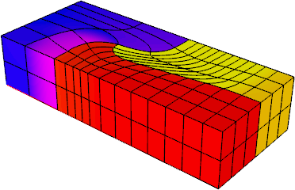

          _                 _               _____   ____  __  __
         | |               | |             |  __ \ / __ \|  \/  |
         | |     __ _  __ _| |__   ___  ___| |__) | |  | | \  / |
         | |    / _` |/ _` | '_ \ / _ \/ __|  _  /| |  | | |\/| |
         | |___| (_| | (_| | | | | (_) \__ \ | \ \| |__| | |  | |
         |______\__,_|\__, |_| |_|\___/|___/_|  \_\\____/|_|  |_|
                      __/ |                                     
                     |___/
 

        Reduced Order Model for High-order Lagrangian Hydrodynamics Miniapp

[](https://travis-ci.org/CEED/Laghos)

## Purpose

**LaghosROM** (LAGrangian High-Order Solver Reduced Order Model) is a miniapp
that accelerates the time-dependent Euler equations of compressible gas
dynamics in a moving Lagrangian frame using unstructured high-order finite
element spatial discretization and explicit high-order time-stepping.

The main version of LaghosROM is in the Laghos/rom subdirectory. The purpose of
the LaghosROM is to demonstrate the efficiency and accuracy of reduced order
modeling with hyperreduction for hydrodynamics in LaghosROM. Various options
are available for the user to apply to several model problems. In particular,
time-windowing is supported, to keep reduced basis dimensions small. Parametric
ROM capabilities allow for building ROM bases from offline training simulations
using multiple PDE parameter samples.

LaghosROM is based on the following article:

> D. Copeland, K. Huynh, S.W. Cheung, and Y. Choi <br>
> [Reduced order models for Lagrangian hydrodynamics]() <br>
> *In Preparation*, 2021.

To see the purpose of **Laghos**, please see README.md in Laghos directory.

## Characteristics

The problem that LaghosROM is solving is formulated as a big (block) system of
ordinary differential equations (ODEs) for the unknown (high-order) velocity,
internal energy and mesh nodes (position). The left-hand side of this system of
ODEs is controlled by *mass matrices* (one for velocity and one for energy),
while the right-hand side is constructed from a *force matrix*.

LaghosROM supports two options for deriving and solving the ODE system, namely
the *full assembly* and the *partial assembly* methods. Partial assembly is the
main algorithm of interest for high orders. For low orders (e.g. 2nd order in
3D), both algorithms are of interest.

The full assembly option relies on constructing and utilizing global mass and
force matrices stored in compressed sparse row (CSR) format.  In contrast, the
[partial assembly](http://ceed.exascaleproject.org/ceed-code) option defines
only the local action of those matrices, which is then used to perform all
necessary operations. As the local action is defined by utilizing the tensor
structure of the finite element spaces, the amount of data storage, memory
transfers, and FLOPs are lower (especially for higher orders).

Other computational motives in Laghos include the following:

- Support for unstructured meshes, in 2D and 3D, with quadrilateral and
  hexahedral elements (triangular and tetrahedral elements can also be used, but
  with the less efficient full assembly option). Serial and parallel mesh
  refinement options can be set via a command-line flag.
- Explicit time-stepping loop with a variety of time integrator options. Laghos
  supports Runge-Kutta ODE solvers of orders 1, 2, 3, 4 and 6, as well as a
  specialized Runge-Kutta method of order 2 that ensures exact energy
  conservation on fully discrete level (RK2Avg).
- Continuous and discontinuous high-order finite element discretization spaces
  of runtime-specified order.
- Moving (high-order) meshes.
- Separation between the assembly and the quadrature point-based computations.
- Point-wise definition of mesh size, time-step estimate and artificial
  viscosity coefficient.
- Constant-in-time velocity mass operator that is inverted iteratively on
  each time step. This is an example of an operator that is prepared once (fully
  or partially assembled), but is applied many times. The application cost is
  dominant for this operator.
- Time-dependent force matrix that is prepared every time step (fully or
  partially assembled) and is applied just twice per "assembly". Both the
  preparation and the application costs are important for this operator.
- Domain-decomposed MPI parallelism.
- Optional in-situ visualization with [GLVis](http:/glvis.org) and data output
  for visualization and data analysis with [VisIt](http://visit.llnl.gov).

The ROM version with hyperreduction uses the same code as the full-order version
on a sample mesh constructed to contain sampled degrees of freedom.
Consequently, many of the full-order Laghos features can also be used in the ROM
version, e.g. unstructured meshes, various time integrators, high-order finite
element spaces, and partial assembly.

One additional feature in the ROM version is the option to use Gram-Schmidt to
orthogonalize the ROM bases for velocity and energy with respect to the
corresponding mass matrices. This reduces the mass matrices to identity,
obviating the need to compute the action of the mass matrix inverses.

Some features not yet available in the ROM version are parallel computation (the
online ROM simulation is small and runs on only one MPI process) and GPU
acceleration. Support for these is planned as future work.

To see the characteristics of **Laghos**, please see README.md in Laghos directory.

## Code Structure

- The file `laghos.cpp` contains the main driver with the time integration loop
  for an offline (full-order) or online (ROM) simulation.
- In each time step, the ODE system of interest is constructed and solved by
  the class `LagrangianHydroOperator`, in the offline (full-order) case. For the
  online ROM case, the reduced system is constructed and solved using the
  ROM_Basis and ROM_Operator classes in `laghos_rom.hpp` and `laghos_rom.cpp`.
- In the offline case, the class ROM_Sampler samples the solution and source,
  generating ROM bases.
- All quadrature-based computations are performed in the function
  `LagrangianHydroOperator::UpdateQuadratureData` in `laghos_solver.cpp`.
- Depending on the chosen option (`-pa` for partial assembly or `-fa` for full
  assembly), the function `LagrangianHydroOperator::Mult` uses the corresponding
  method to construct and solve the final ODE system.
- The full assembly computations for all mass matrices are performed by the MFEM
  library, e.g., classes `MassIntegrator` and `VectorMassIntegrator`.  Full
  assembly of the ODE's right hand side is performed by utilizing the class
  `ForceIntegrator` defined in `laghos_assembly.hpp`.
- The partial assembly computations are performed by the classes
  `ForcePAOperator` and `MassPAOperator` defined in `laghos_assembly.hpp`.
- When partial assembly is used, the main computational kernels are the
  `Mult*` functions of the classes `MassPAOperator` and `ForcePAOperator`
  implemented in file `laghos_assembly.cpp`. These functions have specific
  versions for quadrilateral and hexahedral elements.
- The orders of the velocity and position (continuous kinematic space)
  and the internal energy (discontinuous thermodynamic space) are given
  by the `-ok` and `-ot` input parameters, respectively.

## Building

To build the dependencies of LaghosROM: 
```sh
~> cd Laghos/rom
~/Laghos/rom> make setup
```

(Optional) Clone and build GLVis:
```sh
~> cd Laghos/rom/dependencies
~/Laghos/rom/dependencies> git clone https://github.com/GLVis/glvis.git ./glvis
~/Laghos/rom/dependencies> cd glvis/
~/Laghos/rom/dependencies/glvis> make
~/Laghos/rom/dependencies/glvis> cd ..
```
The easiest way to visualize Laghos results is to have GLVis running in a
separate terminal. Then the `-vis` option in Laghos will stream results directly
to the GLVis socket.

Build the LaghosROM
```sh
~> cd Laghos/rom
~/Laghos/rom> make
~/Laghos/rom> make merge
```
This can be followed by `make test` and `make install` to check and install the
build respectively. See `make help` for additional options.

To see the building instruction of **Laghos**, please see README.md in Laghos directory.

## Running

#### Sedov blast

The 3D Sedov blast wave problem can be runned with `-p 1`.

A sample run of the offline stage is:
```sh
./laghos -p 1 -m data/cube01_hex.mesh -pt 211 -tf 0.8 -pa -offline -romsvds -romos -rostype interpolate -romsrhs -bef 1.0 -rpar 0
./laghos -p 1 -m data/cube01_hex.mesh -pt 211 -tf 0.8 -pa -offline -romsvds -romos -rostype interpolate -romsrhs -bef 1.2 -rpar 1
./laghos -p 1 -m data/cube01_hex.mesh -pt 211 -tf 0.8 -pa -offline -romsvds -romos -rostype interpolate -romsrhs -bef 0.8 -rpar 2
./merge -nset 3 -ef 0.9999 -rhs -romos -rostype interpolate -nwinsamp 6
```

A sample run of the full order model is:
```sh
./laghos -p 1 -m data/cube01_hex.mesh -pt 211 -tf 0.8 -pa -bef 1.1 -writesol
```
A corresponding sample run of the reduce order model is:
```sh
./laghos -p 1 -m data/cube01_hex.mesh -pt 211 -tf 0.8 -online -romhr -romos -rostype interpolate -sfacx 1 -sfacv 120 -sface 120 -soldiff -romgs -romsrhs -bef 1.1 -nwin 118 -twp twpTemp.csv
```

The latter produces the following density plot (notice the `-vis` option)


#### Gresho vortex

The 2D Gresho vortex problem can be runned with `-p 4`.

A sample run of the offline stage and the full order model is:
```sh
./laghos -p 4 -m data/square_gresho.mesh -rs 5 -ok 3 -ot 2 -tf 0.62 -s 7 -pa -offline -romsvds -ef 0.9999 -nwinsamp 10 -romos -rostype load -romsrhs -writesol
```
The corresponding run of the reduce order model is:
```sh
./laghos -p 4 -m data/square_gresho.mesh -rs 5 -ok 3 -ot 2 -tf 0.62 -s 7 -online -romhr -sfacv 160 -sface 160 -romsvds -nwin 336 -twp twpTemp.csv -romos -rostype load -romsrhs -romgs -soldiff
```

The latter produce the following velocity magnitude plots (notice the `-vis` option)

<table border="0">
<td> 
<td> 
</table>

#### Taylor-Green vortex

The 3D Taylor-Green vortex problem can be runned with `-p 0`.

A sample run of the offline stage and the full order model is:
```sh
./laghos -p 0 -m data/cube01_hex.mesh -rs 2 -cfl 0.1 -tf 0.25 -pa -offline -romsvds -ef 0.9999 -writesol -romos -rostype load -romsrhs -nwinsamp 10
```
The corresponding run of the reduce order model is:
```sh
./laghos -p 0 -m data/cube01_hex.mesh -rs 2 -cfl 0.1 -tf 0.25 -online -soldiff -romsvds -romos -rostype load -romhr -romsrhs -romgs -sfacv 120 -sface 120 -twp twpTemp.csv -nwin 90
```

The latter produce the following velocity magnitude plots (notice the `-vis` option)

<table border="0">
<td> 
<td> 
</table>

#### Triple-point problem

The 3D triple-point problem can be runned with `-p 3`.

A sample run of the offline stage and the full order model is:
```sh
./laghos -p 3 -m data/box01_hex.mesh -rs 3 -tf 0.1 -cfl 0.05 -pa -offline -writesol -visit - romsvds -romos -rostype load -romsrhs -ef 0.9999 -nwinsamp 10
```
The corresponding run of the reduce order model is:
```sh
./laghos -p 3 -m data/box01_hex.mesh -rs 3 -tf 0.1 -cfl 0.05 -online -soldiff -nwin 28 -romhr -twp twpTemp.csv -romsvds -romos -rostype load -sfacv 2400 -sface 2400 -romgs -romsrhs
```

The latter produces the following specific internal energy plot (notice the `-vis` option)



## Verification of Results

To make sure the results are correct, we tabulate reference final iterations
(`step`), time steps (`dt`) and energies (`|e|`) for the runs listed below:

1. `mpirun -np 8 laghos -p 0 -m data/square01_quad.mesh -rs 3 -tf 0.75 -pa`
2. `mpirun -np 8 laghos -p 0 -m data/cube01_hex.mesh -rs 1 -tf 0.75 -pa`
3. `mpirun -np 8 laghos -p 1 -m data/square01_quad.mesh -rs 3 -tf 0.8 -pa`
4. `mpirun -np 8 laghos -p 1 -m data/cube01_hex.mesh -rs 2 -tf 0.6 -pa`
5. `mpirun -np 8 laghos -p 2 -m data/segment01.mesh -rs 5 -tf 0.2 -fa`
6. `mpirun -np 8 laghos -p 3 -m data/rectangle01_quad.mesh -rs 2 -tf 3.0 -pa`
7. `mpirun -np 8 laghos -p 3 -m data/box01_hex.mesh -rs 1 -tf 3.0 -pa`
8. `mpirun -np 8 laghos -p 4 -m data/square_gresho.mesh -rs 3 -ok 3 -ot 2 -tf 0.62831853 -s 7 -pa`

| `run` | `step` | `dt` | `e` |
| ----- | ------ | ---- | --- |
|  1. |  339 | 0.000702 | 49.6955373491   |
|  2. | 1041 | 0.000121 | 3390.9635545458 |
|  3. | 1154 | 0.001655 | 46.3033960530   |
|  4. |  560 | 0.002449 | 134.0861672235  |
|  5. |  413 | 0.000470 | 32.0120774101   |
|  6. | 2872 | 0.000064 | 56.5470233805   |
|  7. |  528 | 0.000180 | 56.5053488122   |
|  8. |  776 | 0.000045 | 409.8243172608  |

An implementation is considered valid if the final energy values are all within
round-off distance from the above reference values.

## Performance Timing and FOM

Each time step in Laghos contains 3 major distinct computations:

1. The inversion of the global kinematic mass matrix (CG H1).
2. The force operator evaluation from degrees of freedom to quadrature points (Forces).
3. The physics kernel in quadrature points (UpdateQuadData).

By default Laghos is instrumented to report the total execution times and rates,
in terms of millions of degrees of freedom per second (megadofs), for each of
these computational phases. (The time for inversion of the local thermodynamic
mass matrices (CG L2) is also reported, but that takes a small part of the
overall computation.)

Laghos also reports the total rate for these major kernels, which is a proposed
**Figure of Merit (FOM)** for benchmarking purposes.  Given a computational
allocation, the FOM should be reported for different problem sizes and finite
element orders, as illustrated in the sample scripts in the [timing](./timing)
directory.

A sample run on the [Vulcan](https://computation.llnl.gov/computers/vulcan) BG/Q
machine at LLNL is:

```
srun -n 294912 laghos -pa -p 1 -tf 0.6 -pt 911 -m data/cube_922_hex.mesh \
                      --ode-solver 7 --max-steps 4
                      --cg-tol 0 --cg-max-iter 50 -ok 3 -ot 2 -rs 5 -rp 2
```
This is Q3-Q2 3D computation on 294,912 MPI ranks (18,432 nodes) that produces
rates of approximately 125419, 55588, and 12674 megadofs, and a total FOM of
about 2064 megadofs.

To make the above run 8 times bigger, one can either weak scale by using 8 times
as many MPI tasks and increasing the number of serial refinements: `srun -n
2359296 ... -rs 6 -rp 2`, or use the same number of MPI tasks but increase the
local problem on each of them by doing more parallel refinements: `srun -n
294912 ... -rs 5 -rp 3`.

## Versions

In addition to the main MPI-based CPU implementation in https://github.com/CEED/Laghos,
the following versions of Laghos have been developed

- **SERIAL** version in the [serial/](./serial/README.md) directory.
- **CUDA** version in the [cuda/](./cuda/README.md) directory. This version supports GPU acceleration.
- **RAJA** version in the [raja/](./raja/README.md) directory. This version supports GPU acceleration. See [GitHub](https://software.llnl.gov/RAJA/) for more information about RAJA.
- **OCCA** version in the [occa/](./occa/README.md) directory. This version supports GPU and OpenMP acceleration. See the OCCA [website](http://libocca.org/) for more information.
- **AMR** version in the [amr/](./amr/README.md) directory. This version supports dynamic adaptive mesh refinement.
- **MFEM/engines**-based version in the
  [engines-kernels](https://github.com/CEED/Laghos/tree/engines-kernels) branch.

## Contact

You can reach the Laghos team by emailing laghos@llnl.gov or by leaving a
comment in the [issue tracker](https://github.com/CEED/Laghos/issues).

## Copyright

The following copyright applies to each file in the CEED software suite,
unless otherwise stated in the file:

> Copyright (c) 2017, Lawrence Livermore National Security, LLC. Produced at the
> Lawrence Livermore National Laboratory. LLNL-CODE-734707. All Rights reserved.

See files LICENSE and NOTICE for details.
